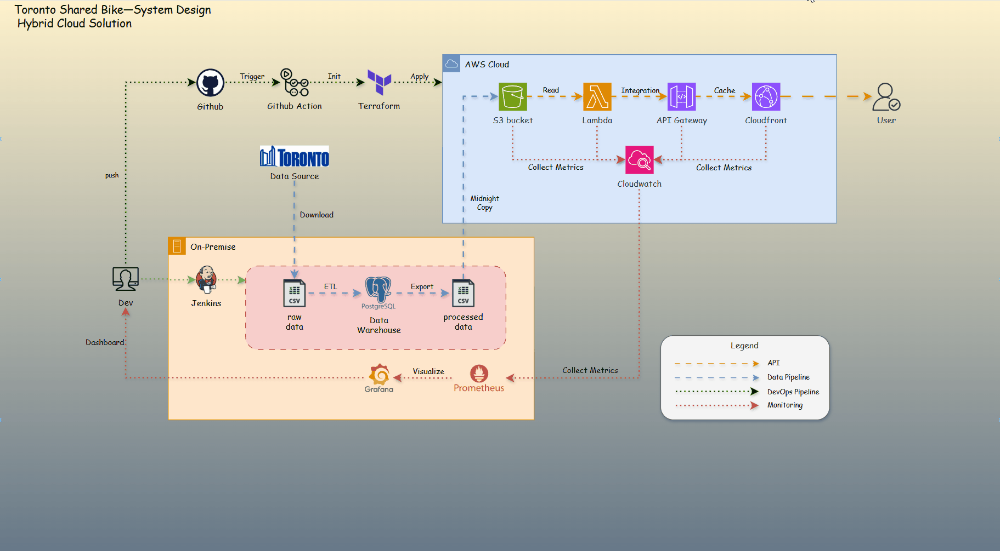

# Portfolio Project - Toronto-Shared-Bike

- [Portfolio Project - Toronto-Shared-Bike](#portfolio-project---toronto-shared-bike)
  - [System Architecture](#system-architecture)
  - [Web Application](#web-application)

---

## System Architecture

---

## Web Application

- Web: [https://trip.arguswatcher.net](https://trip.arguswatcher.net)

- RESTful API

| Url                                      | Description                          |
| ---------------------------------------- | ------------------------------------ |
| `trip.arguswatcher.net/prod/bike`        | Shared bike number over years        |
| `trip.arguswatcher.net/prod/station`     | Bike station number over years       |
| `trip.arguswatcher.net/prod/trip-hour`   | Hourly pattern of shared-bike trips  |
| `trip.arguswatcher.net/prod/trip-month`  | Monthly pattern of shared-bike trips |
| `trip.arguswatcher.net/prod/top-station` | Top 10 stations                      |

---

- [Testing with `k6`](./docs/test.md)

