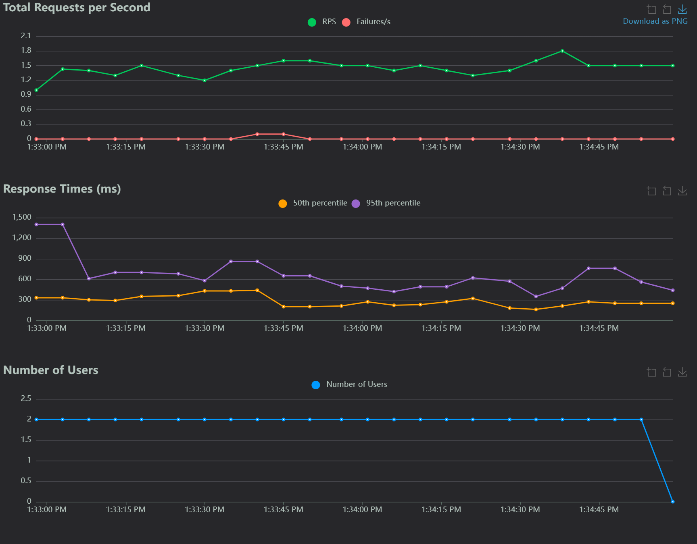
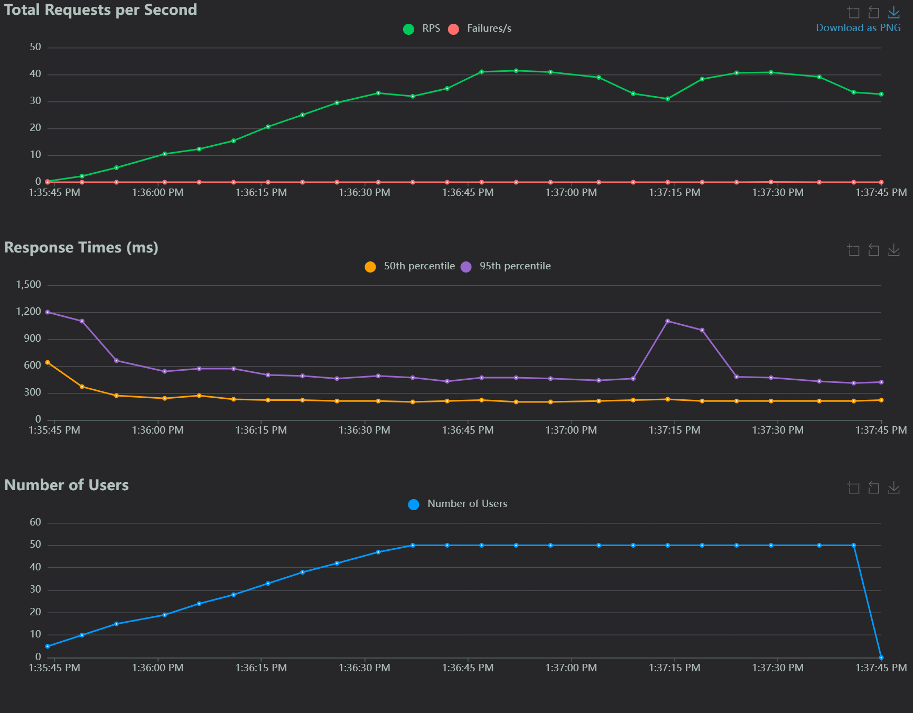
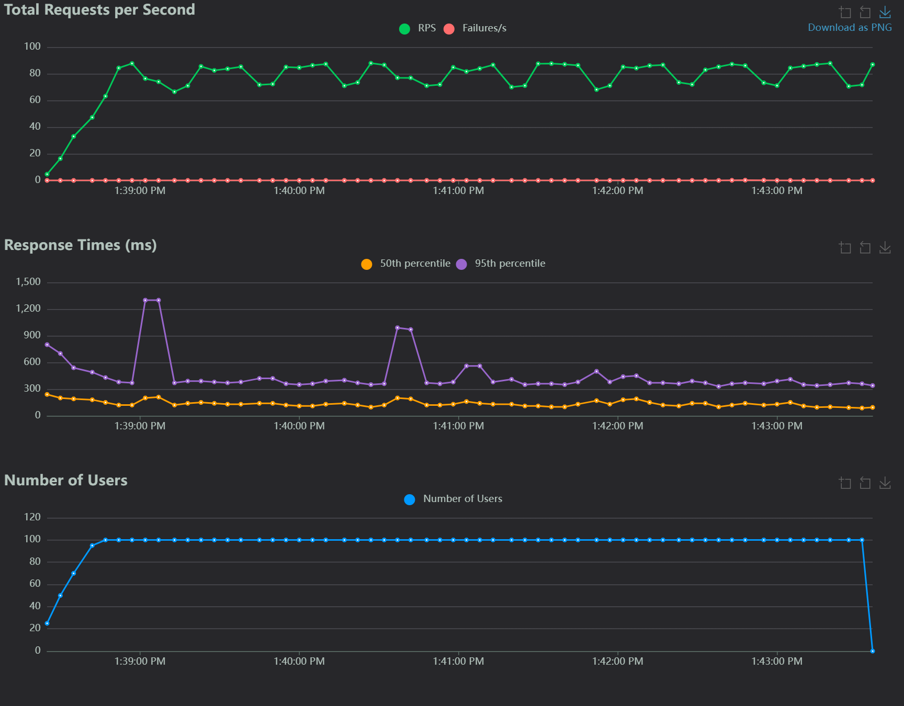
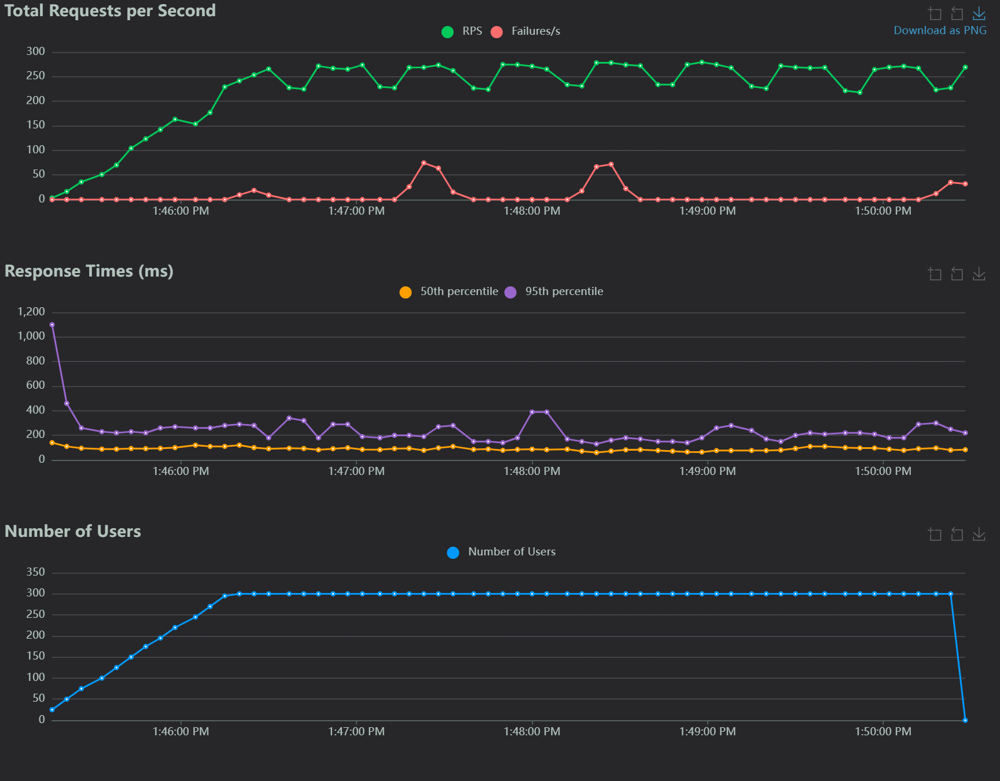
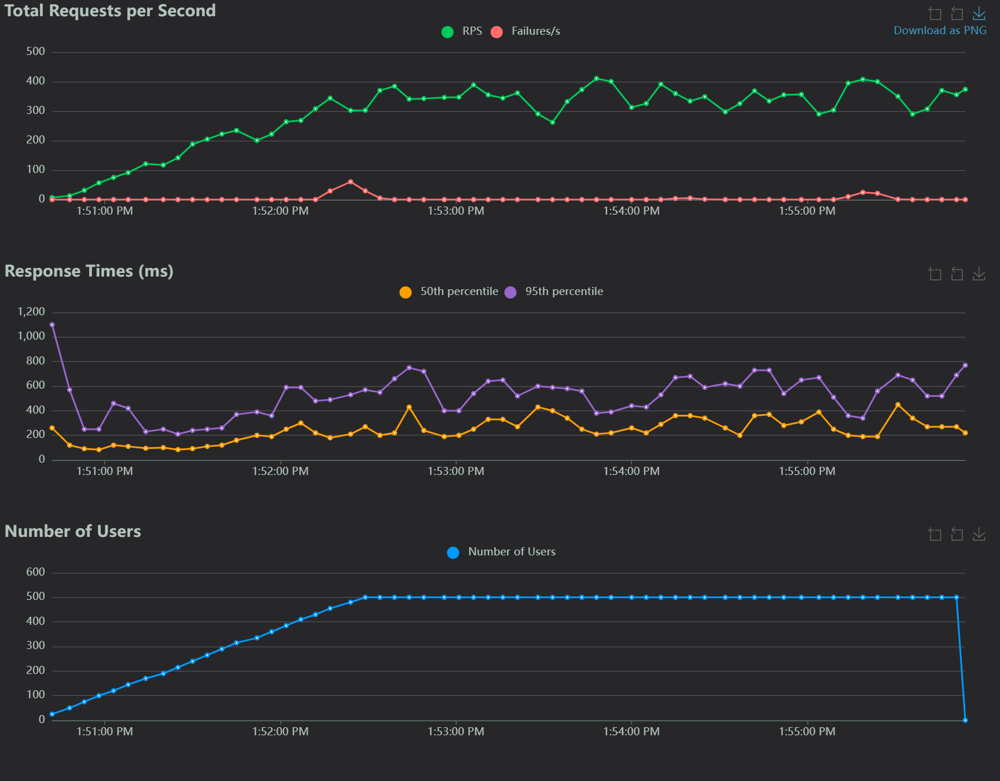
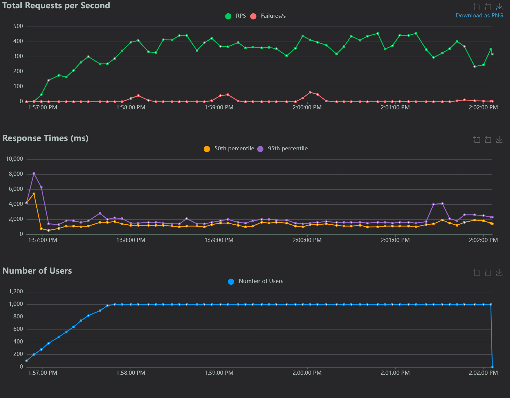
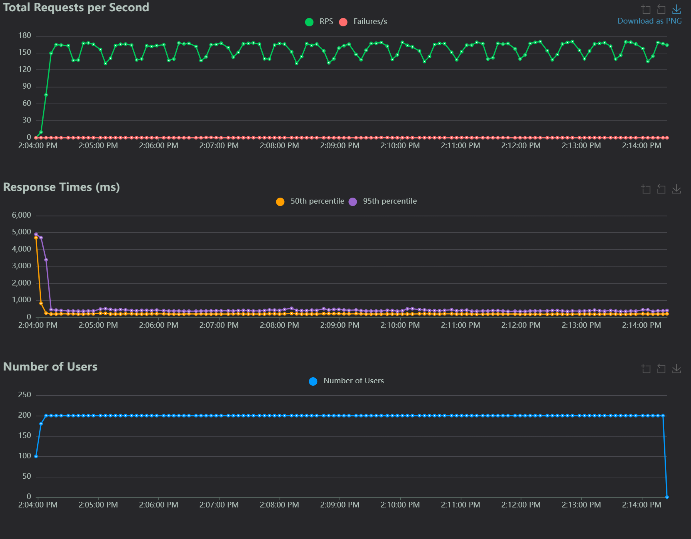

# Portfolio Project - Toronto-Shared-Bike

- [Portfolio Project - Toronto-Shared-Bike](#portfolio-project---toronto-shared-bike)
  - [Architecture](#architecture)
  - [Website](#website)
  - [API Gateway](#api-gateway)
  - [Testing](#testing)
    - [Locust](#locust)
    - [Smoke Testing](#smoke-testing)
    - [Baseline Testing](#baseline-testing)
    - [Load Testing](#load-testing)
    - [Stress Testing](#stress-testing)
    - [Soak Testing](#soak-testing)
  - [K6](#k6)

---

## Architecture


---

## Website

- Domain: [https://trip.arguswatcher.net](https://trip.arguswatcher.net)

---

## API Gateway

| Url                                      | Description                          |
| ---------------------------------------- | ------------------------------------ |
| `trip.arguswatcher.net/prod/bike`        | Shared bike number over years        |
| `trip.arguswatcher.net/prod/station`     | Bike station number over years       |
| `trip.arguswatcher.net/prod/trip-hour`   | Hourly pattern of shared-bike trips  |
| `trip.arguswatcher.net/prod/trip-month`  | Monthly pattern of shared-bike trips |
| `trip.arguswatcher.net/prod/top-station` | Top 10 stations                      |

---

## Testing

| Type               | Category               | Subcategory         | Goal                                                            |
| ------------------ | ---------------------- | ------------------- | --------------------------------------------------------------- |
| `Smoke Testing`    | Functional Testing     | -                   | Verify basic functionality to ensure major features work.       |
| `Baseline Testing` | Non-Functional Testing | Performance Testing | Establish a performance benchmark for normal conditions.        |
| `Load Testing`     | Non-Functional Testing | Performance Testing | Evaluate performance under expected or peak loads.              |
| `Stress Testing`   | Non-Functional Testing | Performance Testing | Identify breaking points and recovery under extreme conditions. |
| `Soak Testing`     | Non-Functional Testing | Performance Testing | Ensure long-term stability under sustained typical loads.       |

### Locust

```sh
cd locust
docker compose down && docker compose up -d --scale worker=2
```

---

### Smoke Testing

```sh
# smoke Testing
docker compose exec -it master locust -f /mnt/locust/locustfile.py --headless --expect-workers 2 -u 2 -r 2 --host https://trip.arguswatcher.net --run-time 2m --html /mnt/locust/html/smoke.html --csv /mnt/locust/csv/smoke
```



---

### Baseline Testing

```sh
# baseline Testing
docker compose exec -it master locust -f /mnt/locust/locustfile.py --headless --expect-workers 2 -u 50 -r 1 --host https://trip.arguswatcher.net --run-time 2m --html /mnt/locust/html/baseline.html --csv /mnt/locust/csv/baseline
```



---

### Load Testing

```sh
# load Testing - VU 100
docker compose exec -it master locust -f /mnt/locust/locustfile.py --headless --expect-workers 2 -u 100 -r 5 --host https://trip.arguswatcher.net --run-time 5m --html /mnt/locust/html/load_100.html --csv /mnt/locust/csv/load_100
```



```sh
# load Testing - VU 300
docker compose exec -it master locust -f /mnt/locust/locustfile.py --headless --expect-workers 2 -u 300 -r 5 --host https://trip.arguswatcher.net --run-time 5m --html /mnt/locust/html/load_300.html --csv /mnt/locust/csv/load_300
```



```sh
# load Testing - VU 500
docker compose exec -it master locust -f /mnt/locust/locustfile.py --headless --expect-workers 2 -u 500 -r 5 --host https://trip.arguswatcher.net --run-time 5m --html /mnt/locust/html/load_500.html --csv /mnt/locust/csv/load_500
```



---

### Stress Testing

```sh
# Stress Testing - VU 1000
docker compose exec -it master locust -f /mnt/locust/locustfile.py --headless --expect-workers 2 -u 1000 -r 20 --host https://trip.arguswatcher.net --run-time 5m --html /mnt/locust/html/load_1000.html --csv /mnt/locust/csv/load_1000
```



---

### Soak Testing

```sh
# Soak Testing
docker compose exec -it master locust -f /mnt/locust/locustfile.py --headless --expect-workers 2 -u 200 -r 20 --host https://trip.arguswatcher.net --run-time 10m --html /mnt/locust/html/soak_200_10m.html --csv /mnt/locust/csv/soak_200_10m
```



---

## K6

```sh
docker run --rm -i grafana/k6 run --vus 10 --duration 30s - <demo.js

docker run --rm -i grafana/k6 run  --iterations=100 --vus=10 --summary-trend-stats="med,p(95),p(99.9)" - < demo.js

docker run --rm -i grafana/k6 run - <demo_rampup.js
docker run --rm -i grafana/k6 --version && k6 run - <demo_rampup.js
```

- Visualize with Grafana

```sh
docker run --rm -i grafana/k6 run - <grafana.js
docker run --rm -i grafana/k6  cloud login --token a5a29b6faf34b69d8af34681621a71676a0dfaf2fbb118a307c81fbac13fccd3

 cloud login --token a5a29b6faf34b69d8af34681621a71676a0dfaf2fbb118a307c81fbac13fccd3


docker run --rm -i -e K6_WEB_DASHBOARD=true -e K6_WEB_DASHBOARD_EXPORT=/html/report.html -v ./html:/html grafana/k6 run - <grafana.js
```

```sh
cd k6
docker build -t k6 .

# smoke testing
docker run --rm --name k6_con --env-file ./.env -v ./script:/app k6 cloud run cloud_smoke.js

# load testing: 20
docker run --rm --name k6_con --env-file ./.env -v ./script:/app k6 cloud run cloud_load_20.js

# stress testing: 100 vu
docker run --rm --name k6_con --env-file ./.env -v ./script:/app k6 cloud run cloud_stress.js

# stress testing: 200 vu
docker run --rm --name k6_con -e K6_WEB_DASHBOARD=true -e K6_WEB_DASHBOARD_EXPORT=stress_200.html -v ./script:/app k6 run local_stress_200.js

# spike testing: 2000vu
docker run --rm --name k6_con -e K6_WEB_DASHBOARD=true -e K6_WEB_DASHBOARD_EXPORT=spike_2000.html -v ./script:/app k6 run local_spike_2000.js

# breakpoint testing: 2000vu
docker run --rm --name k6_con -e K6_WEB_DASHBOARD=true -e K6_WEB_DASHBOARD_EXPORT=breakpoint.html -v ./script:/app k6 run local_breakpoint_2000.js
```
