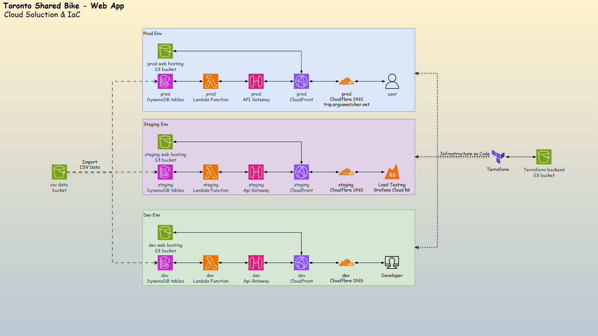

# Toronto Shared Bike Analytics - A Hybrid Cloud Project

- [Toronto Shared Bike Analytics - A Hybrid Cloud Project](#toronto-shared-bike-analytics---a-hybrid-cloud-project)
  - [Overview](#overview)
  - [Architecture](#architecture)
  - [Project Demo](#project-demo)
  - [Key Features \& Tech Skills](#key-features--tech-skills)
  - [Detailed Documentation](#detailed-documentation)

---

## Overview

A `hybrid cloud` project designed and automated to analyze [Toronto’s Shared Bike](https://bikesharetoronto.com/) data, revealing user behavior and usage trends.

- **On-Prem Data Warehouse**: Built and automated a local `PostgreSQL`-based data warehouse using `Docker` and `Jenkins` to run nightly `ETL pipelines`, handling data aggregation for over **13 million records** and performance monitoring.

- **AWS Serverless Application**: Deployed a [REST API](https://trip.arguswatcher.net/prod/bike) and interactive [web](https://trip.arguswatcher.net/) visualization using `AWS` services, with infrastructure managed by `Terraform` and `CI/CD` powered by `GitHub Actions`.

---

## Architecture

- **On-Prem Solution**

- **Cloud Solution**
  - Website URL: https://trip.arguswatcher.net/

---

## Project Demo

- **CI/CD Pipeline - GitHub Actions**

---

## Key Features & Tech Skills

| Feature                          | Tools & Technologies                                |
| -------------------------------- | --------------------------------------------------- |
| **CI/CD Automation**             | Jenkins (on-prem), GitHub Actions (serverless)      |
| **Infrastructure as Code (IaC)** | Terraform                                           |
| **Cloud Platform**               | AWS (Lambda, API Gateway, DynamoDB, S3, CloudFront) |
| **On-Prem Infrastructure**       | Proxmox VE, Docker                                  |
| **ETL Pipeline**                 | PostgreSQL, Jenkins, SQL, Shell scripting           |
| **Monitoring & Load Testing**    | Grafana, k6 (Grafana Cloud)                         |

---

## Detailed Documentation

- [Proxmox VE](./docs/pve/pve.md)
- [Initialize VM & Auto Install](./docs/init/init.md)
- [Testing (Unit Test & Load Testing)](./docs/testing/testing.md)

---
