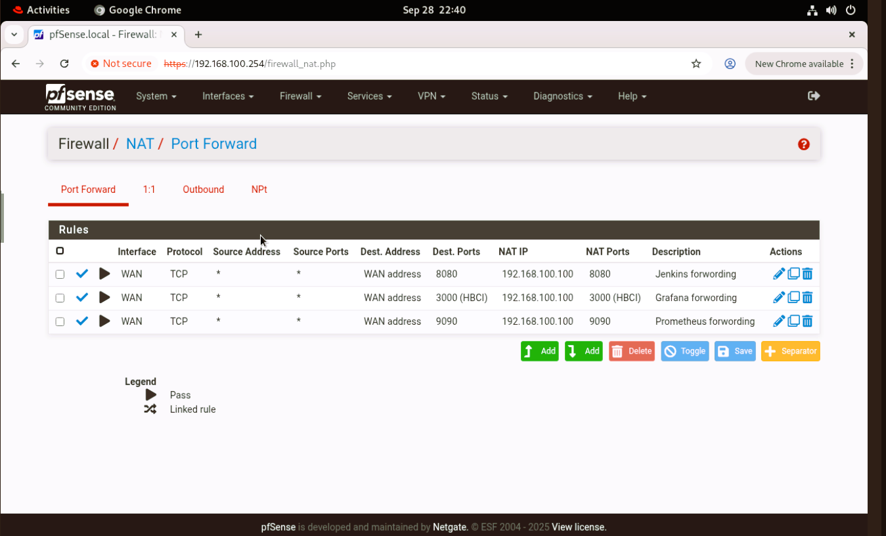
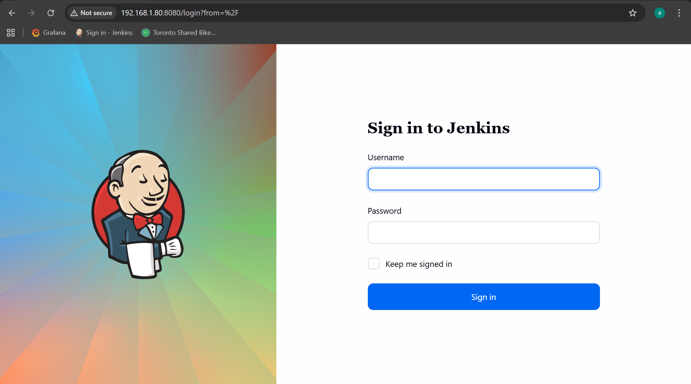
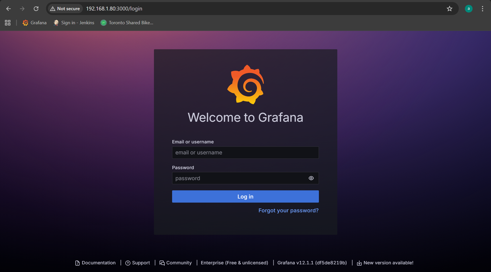

# Proxmox VE Setup

[Back](../../README.md)

- [Proxmox VE Setup](#proxmox-ve-setup)
  - [Challenge: Map Wifi to Proxmox NIC (Skip)](#challenge-map-wifi-to-proxmox-nic-skip)
  - [Challenge: Port Forwarding](#challenge-port-forwarding)
  - [Initialize VM](#initialize-vm)

---

## Challenge: Map Wifi to Proxmox NIC (Skip)

- By default, PVE uses ethernet network.
  - Further configuration is required when using Wifi

```sh
apt-get update && apt-get upgrade -y
apt-get install -y iptables

# List Filter Table
iptables -L -v -n
# NAT Table (includes MASQUERADE, DNAT, SNAT):
iptables -t nat -L -v -n

iptables-save

# Flush All Chains
iptables -F         # Flush filter table
iptables -t nat -F  # Flush NAT table
iptables -t mangle -F
iptables -t raw -F

# Delete All User-defined Chains:
iptables -X
iptables -t nat -X

# Zero All Counters
iptables -Z

netfilter-persistent save
```

- Map gateway to the wifi

```sh
# Map outgoing traffic from 192.168.10.0/24 to the Proxmox host’s Wi-Fi interface (wlp7s0).
iptables -t nat -A POSTROUTING -s 192.168.10.0/24 -o wlp7s0 -j MASQUERADE
# Allows traffic from virtual bridge (vmbr0) out to the Wi-Fi (wlp7s0).
iptables -A FORWARD -i vmbr0 -o wlp7s0 -j ACCEPT
# Allows return traffic from the internet (wlp7s0) to reach virtual bridge (vmbr0)
iptables -A FORWARD -i wlp7s0 -o vmbr0 -m state --state RELATED,ESTABLISHED -j ACCEPT

netfilter-persistent save
```

- Confirm

```sh
# connect with PVE host
ssh root@192.168.1.80

# connect with VM with ProxyJump
ssh -J root@192.168.1.80 aadmin@192.168.100.110
```


---

## Challenge: Port Forwarding

- Map Jenkins(8080) and Grafana(3000) to WAN(192.168.10.254:8080)

```sh
# Forward incoming traffic on WIFI aadress 192.168.1.80:8080 to pfSense WAN addresss 192.168.10.100:8080
iptables -t nat -A PREROUTING -d 192.168.1.80 -p tcp --dport 8080 -j DNAT --to-destination 192.168.10.254:8080
# Allow forwarding from the source network to the target machine
iptables -A FORWARD -p tcp -d 192.168.10.254 --dport 8080 -m state --state NEW,ESTABLISHED,RELATED -j ACCEPT
netfilter-persistent save

# Forward incoming traffic on WIFI aadress 192.168.1.80:3000 to pfSense WAN addresss 192.168.10.100:3000
iptables -t nat -A PREROUTING -d 192.168.1.80 -p tcp --dport 3000 -j DNAT --to-destination 192.168.10.254:3000
# Allow forwarding from the source network to the target machine
iptables -A FORWARD -p tcp -d 192.168.10.254 --dport 3000 -m state --state NEW,ESTABLISHED,RELATED -j ACCEPT
netfilter-persistent save
```

- Configure Port Forwarding with pfSense
  - Map WAN(192.168.10.254:8080) to LAN(192.168.100.254:8080)




---

- Test Connection (Jenkins) after deployment



- Test Connection (Grafana) after deployment



---

## Initialize VM

```sh
sudo apt-get update
sudo apt-get install -y openssh-server vim
# enable pwd auth
sudo nano /etc/ssh/sshd_config
# PasswordAuthentication yes
sudo systemctl restart ssh

# configure ip

echo
echo "##############################"
echo "Update apt"
echo "##############################"
echo
sudo apt-get update && sudo apt-get upgrade -y

echo
echo "##############################"
echo "Set IP"
echo "##############################"
echo
sudo touch /etc/netplan/01-netcfg.yaml
sudo tee /etc/netplan/01-netcfg.yaml << EOF
network:
  version: 2
  renderer: networkd
  ethernets:
    ens18:
      dhcp4: no
      addresses:
        - 192.168.100.110/24
      routes:
        - to: default
          via: 192.168.100.254
      nameservers:
        addresses: [192.168.100.254, 8.8.8.8]
EOF

sudo chmod 600 /etc/netplan/01-netcfg.yaml
sudo netplan apply

sudo reboot
```
